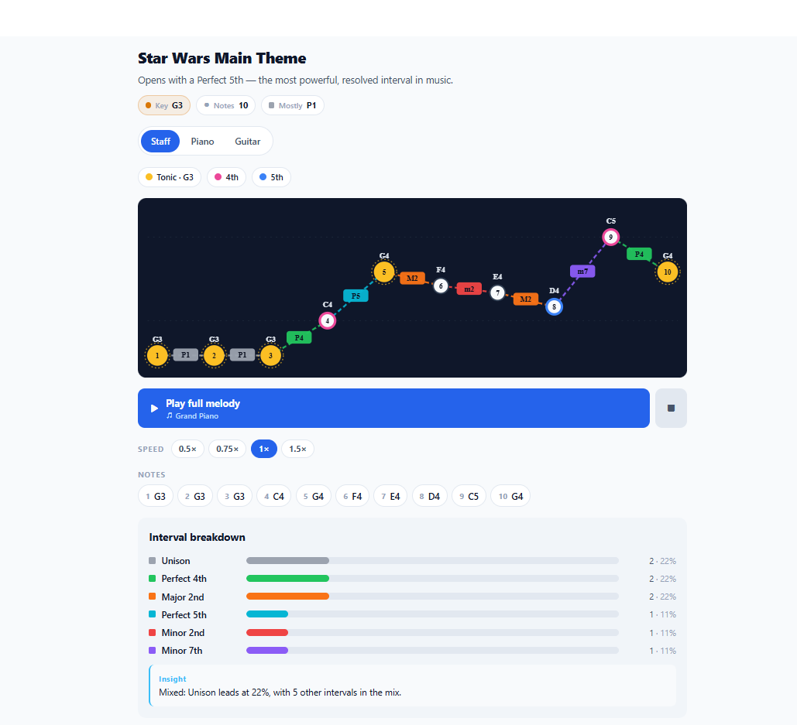
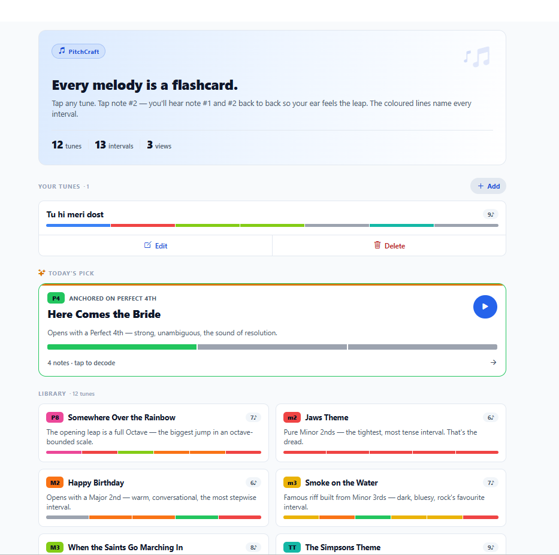
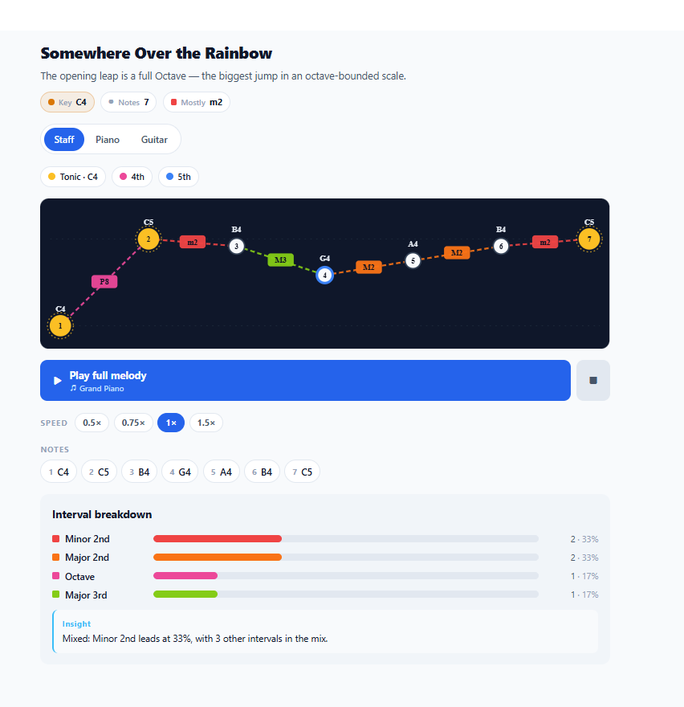
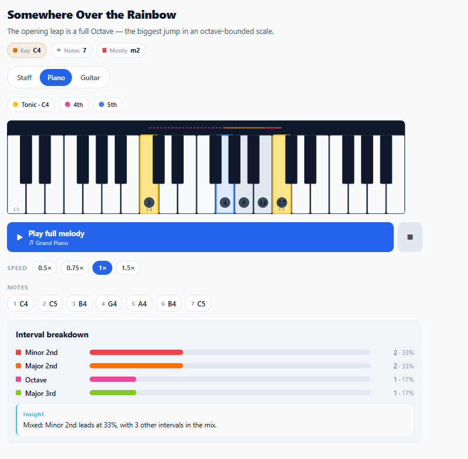
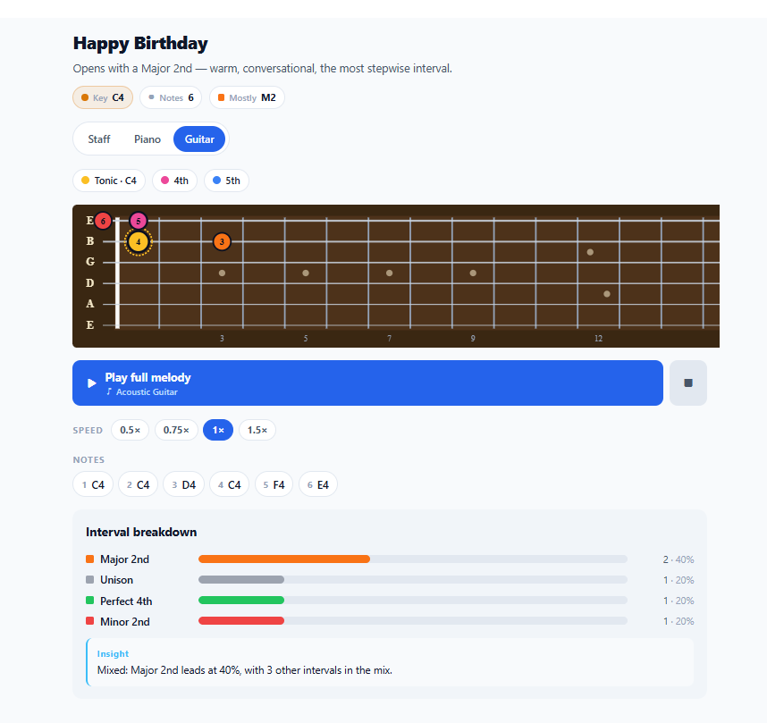
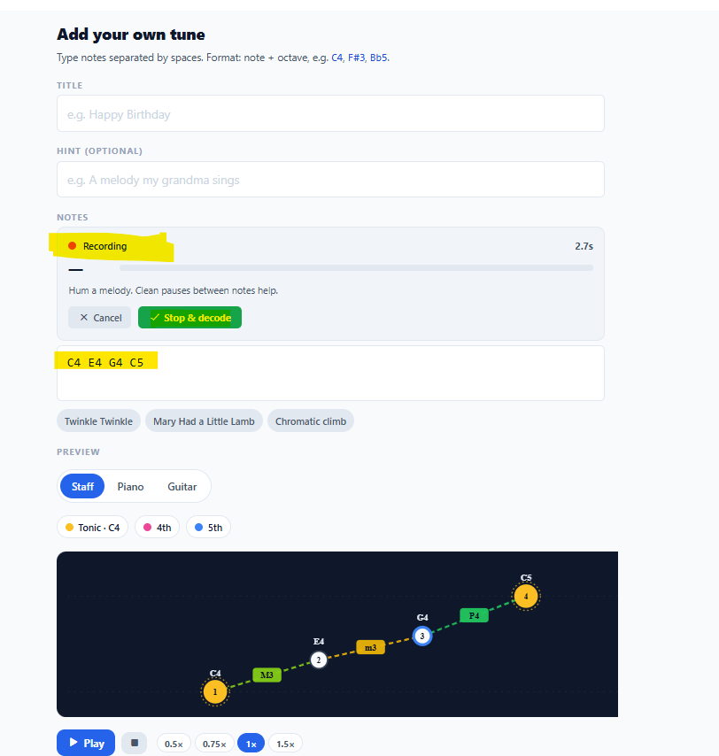
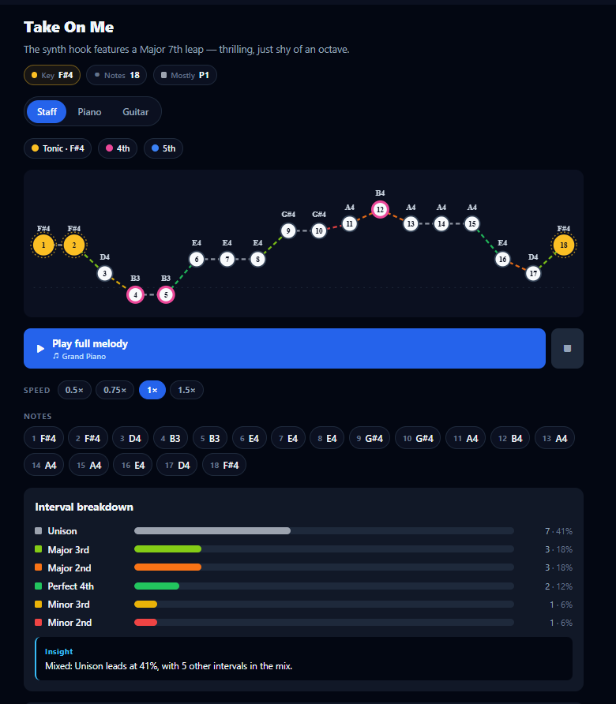
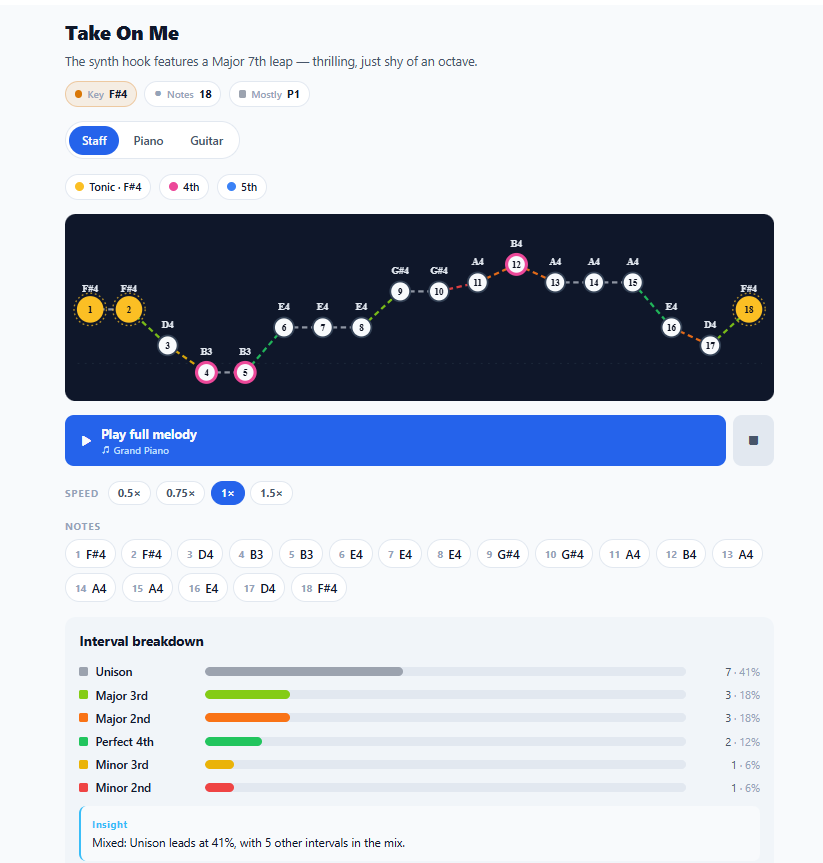
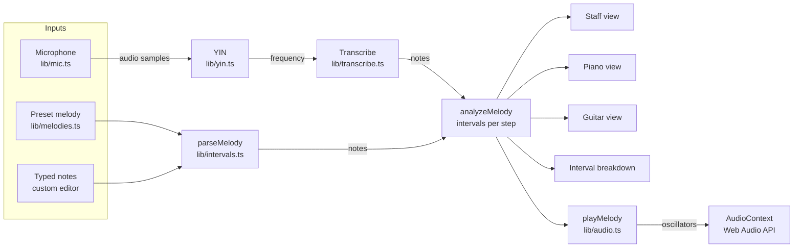

# PitchCraft

> Turn any melody you already know into an interval flashcard.

<p align="center">
  
</p>

PitchCraft is a music ear-training web app built around one insight: **every famous melody is secretly a labeled interval exercise**. If you can hum "Somewhere Over the Rainbow," your brain already knows what an octave leap feels like — it just needs the label. PitchCraft attaches the labels.

Pick a tune. Tap through its notes. You'll hear each interval back-to-back and see it decoded visually on a staff, piano, or guitar fretboard.

---

## Table of contents

- [What it does](#what-it-does)
- [Feature tour](#feature-tour)
- [Getting started](#getting-started)
- [How to use](#how-to-use)
- [Project structure](#project-structure)
- [Architecture notes](#architecture-notes)
- [Key algorithms](#key-algorithms)
- [Browser compatibility](#browser-compatibility)
- [Known limitations](#known-limitations)
- [Ideas for v2](#ideas-for-v2)

---

## What it does

- **Decodes melodies into intervals**: shows every leap between consecutive notes, labeled (M3, P5, Octave, etc.) and color-coded, on a staff / piano / guitar view.
- **Plays back the melody** in Grand Piano or Acoustic Guitar voice at adjustable speeds.
- **Highlights tonic, 4th, and 5th** of the key so you can read the melody's scale-degree structure at a glance.
- **Records from your microphone**: hum a tune and PitchCraft transcribes it into notes via the YIN pitch-detection algorithm.
- **Saves custom tunes** to your browser (AsyncStorage). Edit, delete, rename anytime.
- **Dark + light theme** with preference persisted.

---

## Feature tour

### Melody library

<p align="center">
  
</p>

Ships with 12 curated melodies, each chosen because it *showcases one specific interval*. This is the "anchor a song to every interval" method — once you internalise `Jaws = m2`, your brain can recognise m2 anywhere it hears it.

Each card has a tiny **interval fingerprint** underneath — a horizontal strip coloured by the melody's intervals, so each tune has a unique visual signature before you even tap it.

| Interval | Anchor tune |
| --- | --- |
| m2 | Jaws theme |
| M2 | Happy Birthday |
| m3 | Smoke on the Water |
| M3 | When the Saints Go Marching In |
| P4 | Here Comes the Bride |
| TT (tritone) | The Simpsons theme |
| P5 | Star Wars main theme |
| m6 | The Entertainer |
| M6 | My Bonnie Lies Over the Ocean |
| m7 | Somewhere (West Side Story) |
| M7 | Take On Me |
| P8 (octave) | Over the Rainbow |

### Three visualisations

The same melody rendered three ways, toggleable:

- **Staff** — dot-and-line representation, notes plotted by pitch height, with colored dashed lines naming each interval.
- **Piano** — horizontal keyboard with used keys tinted + numbered.
- **Guitar** — 15-fret standard-tuning fretboard with an optimal-fingering path calculated to minimize left-hand travel.

<table>
  <tr>
    <td align="center"><br/><sub><b>Staff</b></sub></td>
    <td align="center"><br/><sub><b>Piano</b></sub></td>
    <td align="center"><br/><sub><b>Guitar</b></sub></td>
  </tr>
</table>

All three update with the same active-note highlight during playback.

### Grand Piano + Acoustic Guitar synthesis

No audio samples bundled. Both voices are synthesised on the fly using Web Audio API additive synthesis:

- **Grand Piano**: six sine harmonics at 1/n amplitudes with a hammer-strike envelope.
- **Acoustic Guitar**: triangle fundamental + sine harmonics, with a time-varying low-pass filter sweeping from 3.8 kHz to 1.8 kHz across each note's lifetime.

The active voice follows the view mode — Piano/Staff play with piano tone, Guitar view plays with guitar.

### Playback speeds

`0.5×`, `0.75×`, `1×`, `1.5×` — useful for practising along.

### Scale-role highlighting

The first note is treated as the **tonic** (gold). Any note that's a **4th** above it (pink) or a **5th** above it (blue) gets a distinctive ring. Repeats across octaves — e.g., in a melody starting on C4, both G3 and G5 light up as the 5th.

### Hum it in (microphone input)

<p align="center">
  
</p>

Tap "Hum it in" on the custom-tune editor. Browser prompts for mic permission. Hum your melody — the app:

1. Captures audio at ~30 Hz polling rate.
2. Runs the YIN algorithm on each 2048-sample window to detect the fundamental frequency.
3. Converts frequency to MIDI + cents offset.
4. Segments consecutive same-pitch runs into discrete notes based on pitch stability and silence gaps.

Results appear in the Notes field — editable before you save.

### Custom tunes — full CRUD

Add, edit, delete any tune. Stored in `AsyncStorage` under key `pitchcraft.customMelodies.v1`. Survives reloads on web and across app launches on native.

---

## Getting started

### Prerequisites

- **Node.js** 20.19.4 or later
- **npm** 10 or later
- A modern browser (Chrome/Edge/Safari/Firefox)

### Install and run

```bash
git clone <your-fork-url>
cd pitchCraft
npm install
npx expo start --web --port 8081
```

Open http://localhost:8081 in your browser.

### Test on your phone (same Wi-Fi)

1. Find your PC's LAN IP (`ipconfig` on Windows, `ifconfig` / `ip a` on macOS/Linux).
2. On your phone's browser, open `http://<your-lan-ip>:8081`.
3. The first tap is needed to unlock audio (browsers require a user gesture before playing sound).

### Type-check

```bash
npx tsc --noEmit
```

---

## How to use

### 1. Pick a tune from the library

Open the app. Scroll the home screen. Every card has a **tiny color strip** underneath — that's the interval fingerprint of the melody. Stark red stripe = lots of m2s (Jaws). Cyan strip = lots of P5s (Star Wars). Tap any card to open its decoder.

### 2. Read the decoder screen

At the top you'll see three chips: **Key: C** (tonic), **Notes: 7**, **Mostly: M3**. That's the melody's identity card — what key it's in, how long it is, and which interval dominates.

Below that: a **view toggle** (Staff / Piano / Guitar) and the **scale-role legend** (Tonic · 4th · 5th).

### 3. Tap through the notes

Every visualisation is tap-interactive.

- **Tap note #1** → plays it alone.
- **Tap note #N** → plays notes N−1 and N back-to-back so your ear hears the interval between them.
- The interval between two tapped notes is always visible on the line connecting them (labeled M3, P5, etc.).

### 4. Play the whole melody

Hit the **▶ Play full melody** button. The active note highlights as playback moves. Use **⏸** to pause, **⏹** to stop.

Pick a **speed** (0.5×, 0.75×, 1×, 1.5×). Slow speeds are for practising along; fast for a quick overview.

Switch views while playing — the highlight follows you across Staff / Piano / Guitar.

### 5. Drill a specific interval

In the **Interval breakdown** panel at the bottom, tap any row (e.g. "Perfect 5th — 4 occurrences") to pull up a drill panel. Tap each occurrence to hear just that interval played in isolation.

### 6. Add your own tune

From the home screen, tap **+ Add**. You'll land in the tune editor.

**Method A — type the notes**

Enter notes separated by spaces. Format: `NoteName + Octave`, with `#` or `b` for accidentals.

```
C4 E4 G4 C5        ← a C-major arpeggio
G3 A#3 C4 G3       ← Smoke on the Water
F#4 D5 C#5 A4      ← Take On Me opening
```

Octave numbers follow scientific pitch notation (middle C = C4).

**Method B — hum it in** (web only)

Tap **Hum it in**. Browser prompts for microphone permission — allow. You'll see a live recording card:

- A red pulsing dot and elapsed seconds.
- The **currently detected note** updating in real time.
- A **clarity meter** — green when the pitch is clear, gray when it's ambiguous.
- A live count of notes detected so far.

Hum your melody. **Leave small gaps between notes** — the segmenter uses silences (70 ms+) to mark note boundaries. Hold each note for at least 150 ms. Humming (`hmmm`) works better than singing lyrics because consonants confuse the pitch tracker.

Hit **Stop & decode**. Detected notes fill the Notes field. Edit them if needed. You can also use one of the **example pills** (Twinkle Twinkle, Mary Had a Little Lamb, Chromatic climb) to prefill.

**Preview the tune**

Below the Notes field, the same Staff/Piano/Guitar views render live as you edit. There's a **Play** button in the preview to hear it before saving.

**Save**

Hit **Save tune**. You're back at the home screen with your tune in the "Your tunes" section at the top.

### 7. Edit or delete a custom tune

Each custom tune has two buttons at the bottom of its card: **Edit** and **Delete**. Edit reopens the editor with the tune prefilled. Delete prompts for confirmation.

### 8. Switch themes

Top-right of every screen: a sun/moon icon. Tap to flip between light and dark. Choice persists.

<table>
  <tr>
    <td align="center"><br/><sub><b>Dark</b></sub></td>
    <td align="center"><br/><sub><b>Light</b></sub></td>
  </tr>
</table>

---

## Project structure

```
pitchCraft/
├── app/                          # Expo Router screens (file-based routes)
│   ├── _layout.tsx               # Root stack + ThemeProvider
│   ├── index.tsx                 # Home screen (library + your tunes)
│   ├── decoder.tsx               # Melody decoder screen
│   └── custom.tsx                # Tune editor (create + edit + delete)
│
├── components/
│   ├── StaffView.tsx             # SVG staff with note dots + colored interval lines
│   ├── PianoView.tsx             # SVG piano keyboard with highlighted keys
│   ├── GuitarView.tsx            # SVG fretboard with optimal-fingering dots
│   ├── ViewToggle.tsx            # Staff/Piano/Guitar pill switcher
│   ├── RoleLegend.tsx            # Tonic/4th/5th legend chips
│   ├── IntervalBreakdown.tsx     # Sorted bar chart of intervals + insight text
│   ├── IntervalFingerprint.tsx   # Tiny color strip for tune cards
│   └── HumRecorder.tsx           # Mic UI with live pitch meter
│
├── lib/                          # Pure logic — no React
│   ├── intervals.ts              # Note parsing, interval math, scale-role detection
│   ├── melodies.ts               # The 12 preset melodies + metadata
│   ├── storage.ts                # AsyncStorage wrapper for custom tunes
│   ├── audio.ts                  # Playback engine (voices, envelopes, playMelody)
│   ├── audioContext.ts           # Stub type contract
│   ├── audioContext.web.ts       # Browser AudioContext (picked by Metro on web)
│   ├── fretboard.ts              # Guitar tuning + optimal-fingering algorithm
│   ├── yin.ts                    # YIN pitch-detection algorithm
│   ├── transcribe.ts             # Frequency → MIDI + pitch-stream → note segmentation
│   └── mic.ts                    # MediaStream + AnalyserNode + analysis loop (web only)
│
├── theme/
│   ├── tokens.ts                 # Dark + light palettes, spacing scale, typography
│   └── ThemeContext.tsx          # ThemeProvider + useTheme hook + persistence
│
├── assets/                       # Icons, splash
├── app.json                      # Expo config
├── package.json
└── tsconfig.json
```

---

## Architecture notes

### Data flow at a glance



### Platform-resolved audio context

The playback engine needs an `AudioContext`, which on web is `window.AudioContext` but doesn't exist on native. Rather than littering `Platform.OS === "web"` checks everywhere, the context is isolated in a file resolved by Metro's platform extensions:

- `lib/audioContext.ts` — type stub used by TypeScript
- `lib/audioContext.web.ts` — real implementation (Web Audio API)
- On native, the stub returns `null` and audio becomes a silent no-op

All playback logic (`lib/audio.ts`) imports from `./audioContext` and stays platform-agnostic. Metro picks the right file at bundle time.

### Theming via tokens + Context

Every screen and component calls `useTheme()` and derives styles via a `makeStyles(colors)` function wrapped in `useMemo`:

```ts
const { colors } = useTheme();
const styles = useMemo(() => makeStyles(colors), [colors]);
```

This means flipping the theme re-renders every style across the app. The `interval` palette (m2 red → P8 pink) and `role` palette (tonic gold, 4th pink, 5th blue) stay **constant** across themes — they're information-carrying colors that shouldn't change meaning.

### Responsive staff layout

The staff chooses one of three layouts depending on melody length:

- Short (default spacing comfortably fits): stretch each note up to 130 px, center in the card.
- Medium (natural spacing exceeds viewport but MIN_SPACING fits): compress to fit exactly.
- Long (even MIN_SPACING overflows): use MIN_SPACING, allow horizontal scroll.

When spacing drops below 48 px, interval-name chips hide (just the colored line remains) to avoid overlap.

---

## Key algorithms

### Optimal guitar fingering ([lib/fretboard.ts](lib/fretboard.ts))

Each note can be played on multiple (string, fret) positions. To show a realistic playable path, the app picks:

- For the first note: the lowest-fret position.
- For each subsequent note: the position minimising distance to the previous one (fret distance + string-jump penalty).

This produces a linear, playable shape on the fretboard that matches how a guitarist would actually finger the melody.

### YIN pitch detection ([lib/yin.ts](lib/yin.ts))

Textbook YIN (de Cheveigné & Kawahara, 2002):

1. Compute the cumulative-mean-normalized difference function.
2. Find the first local minimum below threshold (0.1).
3. Parabolic interpolation for sub-sample accuracy.
4. Convert period to frequency.

Plus: RMS gate to reject silence, clarity score returned to the caller for downstream segmentation.

### Pitch-stream segmentation ([lib/transcribe.ts](lib/transcribe.ts))

Converts a stream of `{t, midi, clarity}` readings into discrete notes. Rules:

- A sample is **valid** if `clarity >= 0.75`.
- Each "run" has a fixed **anchor pitch** (no drifting average — that used to hide transitions).
- A new sample commits the current run and starts a new one if it exceeds `±0.6` semitones from the anchor.
- A **silence gap** of 70 ms between valid samples also commits — this is how repeated same-pitch notes ("C C") get counted as two.
- Runs shorter than 90 ms are dropped (noise filter).

### Scale-role detection ([lib/intervals.ts:scaleRoleOf](lib/intervals.ts))

```ts
const semisAbove = ((note.midi - base.midi) % 12 + 12) % 12;
if (semisAbove === 0) return "tonic";
if (semisAbove === 5) return "fourth";
if (semisAbove === 7) return "fifth";
```

Octave-agnostic — any G above any C gets the 5th color, regardless of which octave.

---

## Browser compatibility

Tested on:
- Chrome 120+ (desktop, Android)
- Safari 17+ (desktop, iOS)
- Firefox 120+
- Edge 120+

Microphone input (`getUserMedia`) requires HTTPS in production. `localhost` is an exception, so dev works fine over plain HTTP.

iOS Safari note: audio playback needs a user gesture to start. The first tap on any play button unlocks the AudioContext for the session.

---

## Known limitations

- **Web-first.** The app runs natively via `react-native-web` so phone browsers are fully supported, but building a standalone Android or iOS APK requires wiring up native audio (e.g., `react-native-audio-api`) which was removed for simplicity. Instructions in git history if needed.
- **Monophonic only.** The YIN detector picks the strongest fundamental. Chords and harmonies aren't transcribed.
- **Octave errors on very low voices.** YIN occasionally jumps an octave when the first harmonic is louder than the fundamental. Rare for humming.
- **No rhythm.** Detected notes carry pitch but not duration or tempo — playback uses a fixed per-note duration.
- **No backend.** Everything is local. Custom tunes live in your browser's AsyncStorage; switching devices means starting fresh.

---

## Ideas for v2

- Scales, Chords, Rhythm, Sight-reading tracks (beyond just Intervals).
- Adaptive drill queue based on user weak spots.
- Vocal accuracy scoring for each sung interval (cents deviation, stability).
- Streaks, XP, practice heatmap.
- PDF progress reports via Claude API.
- Export custom tunes to MIDI / MP3.
- Share tunes via URL.
- Offline PWA shell with `Add to Home Screen` support.

---

## Screenshots

Images live in [`docs/screenshots/`](docs/screenshots/). The README references them by these filenames:

| Filename | What to capture |
| --- | --- |
| `hero.png` | Decoder screen (Star Wars or Over the Rainbow) with staff view — 760 px wide |
| `home.png` | Home screen with hero card + library — 420 px wide, portrait feel |
| `view-staff.png` | Decoder → Staff view |
| `view-piano.png` | Decoder → Piano view |
| `view-guitar.png` | Decoder → Guitar view |
| `hum-recorder.png` | Custom editor mid-recording (live pitch meter visible) |
| `theme-dark.png` | Any screen in dark theme |
| `theme-light.png` | Same screen in light theme |

To capture: open `http://localhost:8081` at an appropriate window width, use your OS screenshot tool (`Win+Shift+S` on Windows, `Cmd+Shift+4` on macOS), crop, save with the filename above into `docs/screenshots/`. GitHub renders them automatically.

